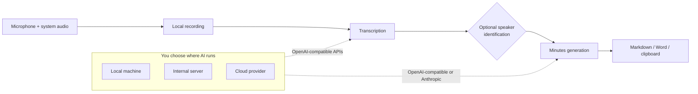
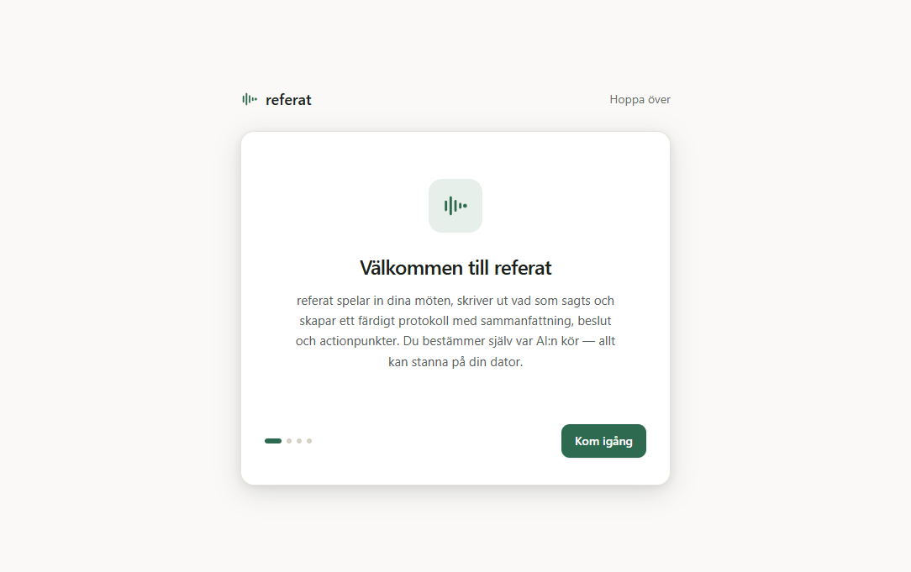

# referat

<p align="center">
  <strong>Private meeting capture. Useful minutes. Your choice of AI.</strong>
</p>

<p align="center">
  <a href="https://github.com/sockulags/referat/releases/latest"></a>
  
  <a href="LICENSE"></a>
  
</p>

<p align="center">
  <a href="https://github.com/sockulags/referat/releases/latest"><strong>Download for Windows</strong></a>
  ·
  <a href="https://sockulags.github.io/referat/">Product site</a>
  ·
  <a href="https://github.com/sockulags/referat/wiki">Documentation</a>
</p>

referat is a Windows desktop app that records system audio and microphone input,
transcribes the conversation, and turns it into a structured summary with decisions and
action items. It works with Teams, Zoom, Meet, or an in-person conversation—without adding
a meeting bot.

You decide where each AI step runs: on your computer, on an internal company server, or
through a cloud provider. Recordings, transcripts, and minutes stay local unless you
explicitly configure an external endpoint.

<p align="center">
  
</p>

## From conversation to decisions

| 1. Record | 2. Process | 3. Use the result |
| --- | --- | --- |
| Capture microphone and Windows system audio with one button. | Transcribe, optionally identify speakers, then generate structured minutes. | Review the transcript and export the result as Markdown or Word. |

<p align="center">
  
  
</p>

## Why referat

- **No meeting bot.** System-audio capture works across meeting tools and for in-person
  conversations.
- **Deployment is a product choice.** Use local OpenAI-compatible services, internal
  endpoints, OpenAI, Azure OpenAI, or Anthropic for the steps they support.
- **Local-first data handling.** Meeting files live under the user's Windows app-data
  directory. API keys are encrypted with Windows DPAPI through Electron `safeStorage`.
- **Useful output, not just a transcript.** The default flow produces a summary, decisions,
  and action items, with the original transcript available for review.
- **Resilient processing.** Long recordings are segmented, pipeline progress is persisted,
  and interrupted work can resume after restart.
- **No telemetry.** Network traffic is limited to the AI endpoints configured by the user
  and the optional update check.

## Deployment options



| Boundary | Behaviour |
| --- | --- |
| Audio and meeting files | Stored locally by default; uploaded only to the transcription endpoint you configure. |
| API credentials | Encrypted with Windows DPAPI; plaintext keys are never sent back to the renderer. |
| Renderer access | Sandboxed Electron renderer with context isolation and a typed preload boundary. |
| Provider redirects | Authentication-bearing requests reject redirects instead of forwarding credentials. |
| Telemetry | None. |

Read the full [architecture and security model](https://github.com/sockulags/referat/wiki/Architecture).

## Features

- Microphone and Windows WASAPI loopback recording
- Swedish and multilingual transcription through configurable providers
- Optional local speaker diarization
- Customizable prompt/template for meeting minutes
- Markdown and `.docx` export, plus clipboard copy
- Provider connection tests in the app
- Crash recovery and per-step retry
- Automatic update support
- Light and dark themes

> The current application interface is Swedish because Sweden is the initial target market.
> Transcription follows the spoken language. An English interface is on the
> [roadmap](https://github.com/sockulags/referat/wiki/Roadmap).

## Download

Download the Windows installer from the [latest release](https://github.com/sockulags/referat/releases/latest).

The installer is not currently code-signed, so Windows SmartScreen may show a warning on
first launch. The [installation guide](https://github.com/sockulags/referat/wiki/Installation)
explains the limitation and the exact steps. Windows 10 and 11 are supported.

<p align="center">
  
</p>

## Run the AI locally

referat talks to standard `/v1` APIs. A fully local setup can use
[speaches](https://github.com/speaches-ai/speaches) for Whisper transcription and
[Ollama](https://ollama.com/) for minutes generation.

```bash
# Transcription server
docker run --rm -p 8000:8000 ghcr.io/speaches-ai/speaches:latest

# Minutes model
ollama pull llama3.1
ollama serve
```

Configure transcription as `http://localhost:8000/v1` and minutes generation as
`http://localhost:11434/v1`. No API key is required for either local service. For model
selection and troubleshooting, use the complete
[local AI guide](https://github.com/sockulags/referat/wiki/Local-AI-Setup).

## Documentation

- [Installation](https://github.com/sockulags/referat/wiki/Installation) — installer,
  SmartScreen, and first-run setup
- [Configuration](https://github.com/sockulags/referat/wiki/Configuration) — providers,
  models, endpoints, and minutes templates
- [Local AI setup](https://github.com/sockulags/referat/wiki/Local-AI-Setup) — private local
  transcription and summarization
- [Speaker diarization](https://github.com/sockulags/referat/wiki/Speaker-Diarization) —
  optional local "who said what" labels
- [Architecture](https://github.com/sockulags/referat/wiki/Architecture) — process model,
  persistence, recovery, and security boundaries
- [FAQ](https://github.com/sockulags/referat/wiki/FAQ) and
  [roadmap](https://github.com/sockulags/referat/wiki/Roadmap)

## Development

```bash
git clone https://github.com/sockulags/referat.git
cd referat
npm install
npm run dev
```

Validation and packaging:

```bash
npm run lint
npm run typecheck
npm test
npm run build:win
```

Built with Electron, React 19, TypeScript, Tailwind CSS, Zustand, and Vitest.

## Project status

referat is released software under active development. The core recording,
transcription, minutes, export, and update flows are available today. Known limitations and
planned work are kept in the public [roadmap](https://github.com/sockulags/referat/wiki/Roadmap).

## License

[MIT](LICENSE) © Lucas Skog
