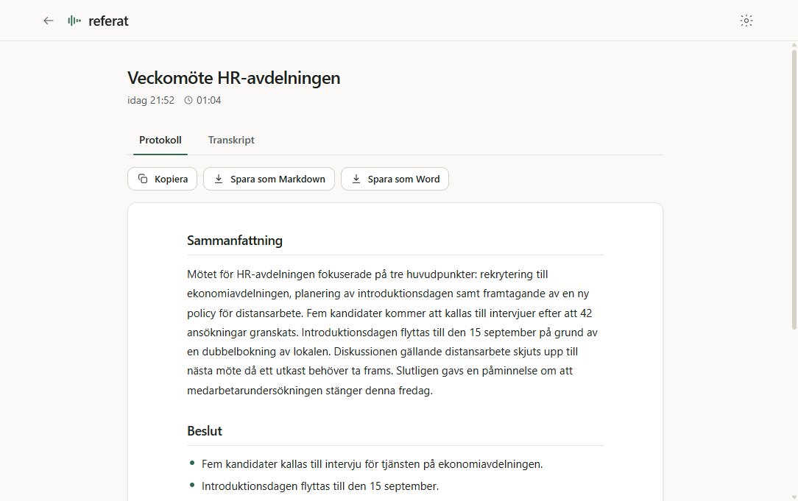
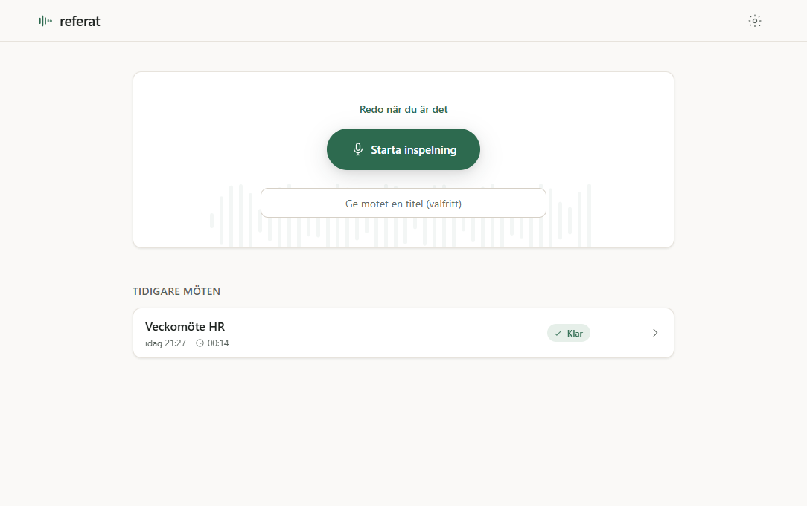
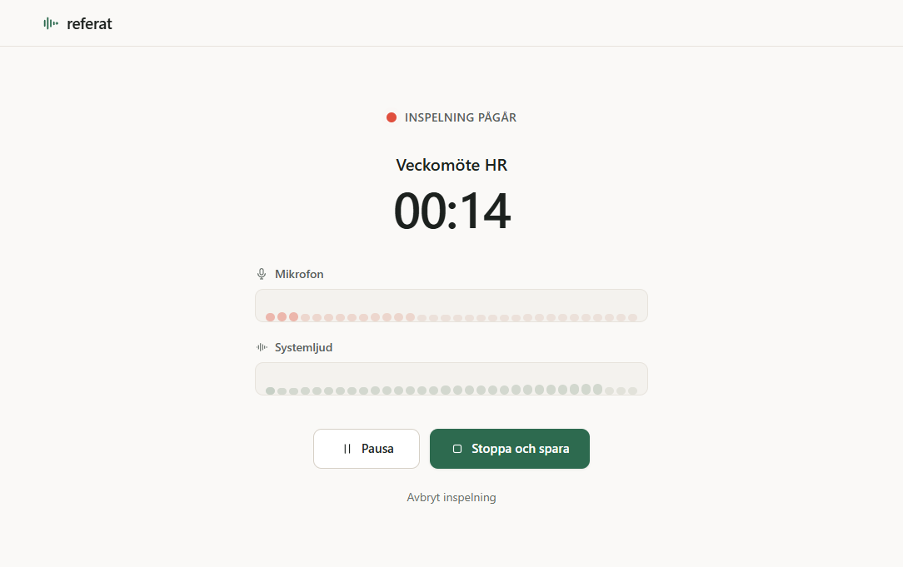

# referat

> Meeting notes that stay on your machine.

referat is a Windows desktop app that records your meetings (system audio + microphone),
transcribes them and writes finished meeting minutes — summary, decisions and action items.
You decide where the AI runs: locally on your machine, on your company's server or with a
cloud provider. Nothing leaves your machine unless you choose it.

<p align="center">
  
</p>

<p align="center">
  
  
</p>

## Features

- **One button**: start recording, get finished minutes when the meeting ends.
- **System audio + microphone**: works with Teams, Zoom and Meet — no bot joins the call.
- **Bring your own AI**: any OpenAI-compatible endpoint (local server, internal server,
  OpenAI, Azure OpenAI) for transcription; OpenAI-compatible or Anthropic for the minutes.
- **Local first**: recordings and minutes are stored on your machine. API keys are
  encrypted with Windows DPAPI (Electron safeStorage) and never leave the machine.
- **Export**: Markdown, Word (.docx) or copy to clipboard.
- **No telemetry**: the app never phones home. Outbound traffic goes only to the endpoints
  you configure.

> The app interface is currently Swedish (its target market). An English UI is on the
> [roadmap](https://github.com/sockulags/referat/wiki/Roadmap).

## Download

- **Installer**: [latest release](https://github.com/sockulags/referat/releases/latest) —
  Windows 10/11.
- **Landing page**: https://sockulags.github.io/referat/

The 0.1 build is not yet code-signed, so Windows SmartScreen may warn on first run. See
[Installation](https://github.com/sockulags/referat/wiki/Installation) for why and how to
proceed.

## Documentation

The full documentation lives in the [wiki](https://github.com/sockulags/referat/wiki):

- [Installation](https://github.com/sockulags/referat/wiki/Installation) — download, the
  SmartScreen note, and the first-run walkthrough.
- [Local AI Setup](https://github.com/sockulags/referat/wiki/Local-AI-Setup) — run
  everything on your machine with speaches and Ollama.
- [Configuration](https://github.com/sockulags/referat/wiki/Configuration) — every setting,
  provider presets and the minutes template.
- [FAQ](https://github.com/sockulags/referat/wiki/FAQ) — cost, storage, privacy and more.
- [Architecture](https://github.com/sockulags/referat/wiki/Architecture) — how it's built
  and the security hardening.
- [Roadmap](https://github.com/sockulags/referat/wiki/Roadmap) — what's planned.

## Development

```bash
npm install
npm run dev        # development mode with HMR
npm run typecheck  # type checking (node + web)
npm run lint
npm run build:win  # Windows installer (NSIS) into release/
```

Stack: Electron + electron-vite, React 19, TypeScript, Tailwind CSS v4, Zustand.

## Local AI quickstart

To keep everything on your own machine, run both transcription and summarization against
local, OpenAI-compatible servers. referat talks to them over standard `/v1` endpoints, so
you need two services running before you pick **On this computer** in the app.

**1. Transcription (speech → text).** The simplest option is
[speaches](https://github.com/speaches-ai/speaches) — an OpenAI-compatible Whisper server
that can run the Swedish [KB-Whisper](https://huggingface.co/KBLab) model:

```bash
docker run --rm -p 8000:8000 ghcr.io/speaches-ai/speaches:latest
```

The server then answers on `http://localhost:8000/v1`. In the app's settings, set the base
URL to `http://localhost:8000/v1`, the model to e.g. `KBLab/kb-whisper-large`, and the
language to `sv`.

**2. Minutes (text → minutes).** Run a language model locally with
[Ollama](https://ollama.com):

```bash
ollama pull llama3.1
ollama serve
```

Ollama exposes an OpenAI-compatible API on `http://localhost:11434/v1`. In the app's
settings, choose the OpenAI-compatible API type, set the base URL to
`http://localhost:11434/v1` and the model to `llama3.1`. Prefer a non-reasoning model —
reasoning-heavy models can return an empty answer, which the app surfaces as an error.

No API key is needed for local servers — leave the field empty. When both services respond,
the app's built-in connection test shows two green checks.

See [Local AI Setup](https://github.com/sockulags/referat/wiki/Local-AI-Setup) for the full
guide.

## License

MIT © Lucas Skog
